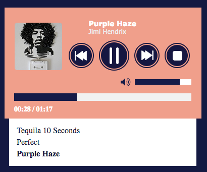

# MINImusic-Player

Free and Open-Source Jquery music player Plugin.

The following features are available free of charge :

* Playlist support;
* Ability to Customise the Controllers to display & the order ;
* Callbacks for almost every single function;
* Autoplay and loop support
* Automatically detects when you insert/remove the headset;
* Supports Multiple Instance on the Same Page. 

## Screenshots



## Usage

1. Include jQuery:

	```html
	<script src="http://ajax.googleapis.com/ajax/libs/jquery/2.1.4/jquery.min.js"></script>
	```

2. Include plugin's code:

	```html
	<script src="dist/musicplayer-min.js"></script>
	```

3. Call the plugin:

	```javascript
	$("#element").musicPlayer({
		propertyName: "custom value"
	});
	```